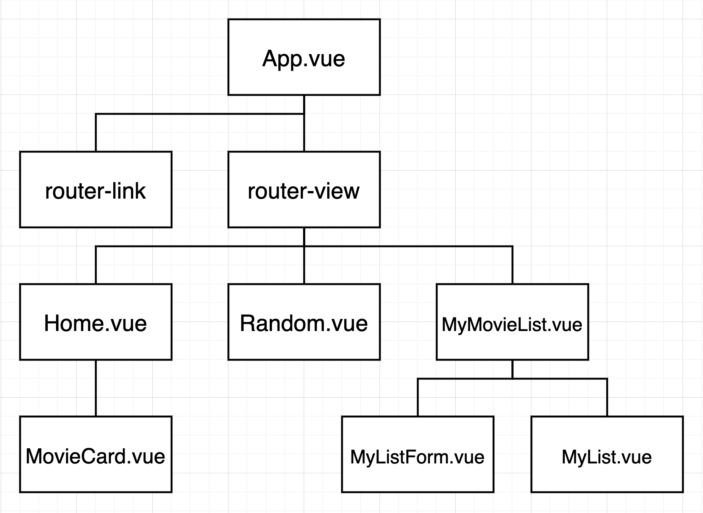
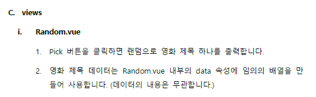
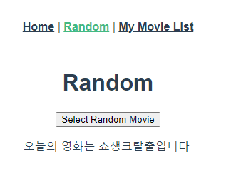
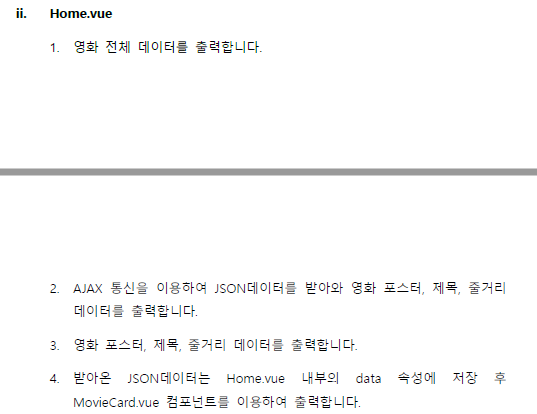
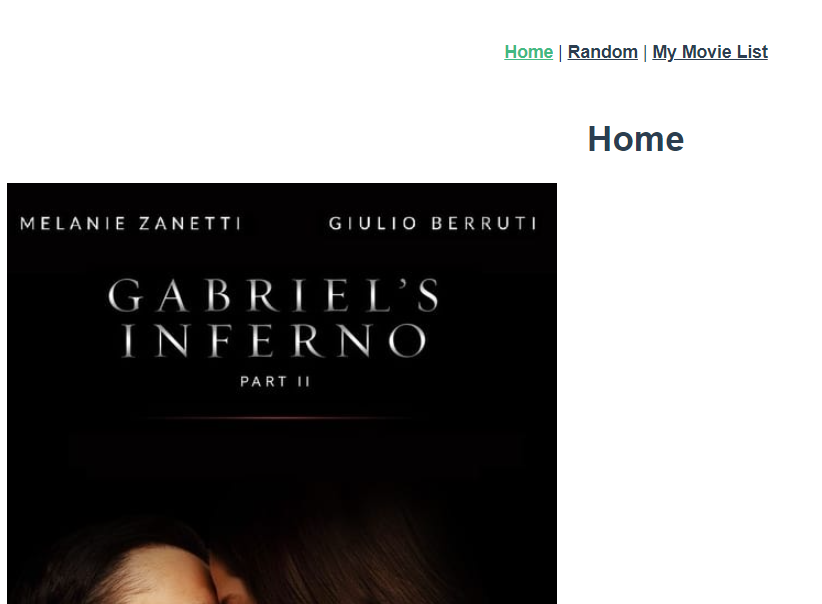
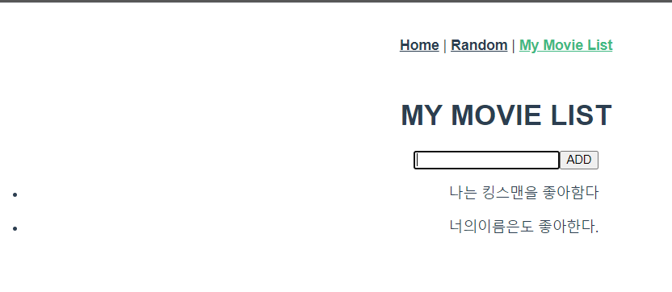

# PJT10

> Vue를 활용한 SPA 구성


### 목표

- 영화 정보를 제공하는 SPA 제작
- l AJAX통신과 JSON 구조에 대한 이해
- l Single File Component 구조에 대한 이해
- l vue-cli, vuex, vue-router등 플러그인 활용


#### 오늘의 프로젝트

1.  Vue Router 와 Prop, Emit 까지는 이해가 되나 아직 코드 구현이 어려움

2. Vuex 또한 마찬가지 잘 모르겠다...

3. 어디에 어떤 코드를 넣어야 하는지 헷갈린다. 

   

### 컴포넌트 구조




### 1. Random






- 버튼을 누르면 영화제목이 랜덤으로 뽑혀 바뀜

- lodash 를 사용하여 영화제목 리스트에서 임의로 뽑음

  ```javascript
  data: function() {
      return {
        movie: ['어바웃타임', '킹스맨', '토르:천둥의신', '쇼생크탈출', '미션임파서블', '이웃집 토토로'],
        selectedMovie: '토르:천둥의신'
      }  },
    methods: {
      pickMovie: function () {
        this.selectedMovie = _.sample(this.movie)
      }  },}
  ```

  

### 2. Home.vue



```vue

```



- 부트스트랩 적용이 잘 안된다.. 특히 vue bootstrap은 더더욱 이상하다..


### My Movie List



